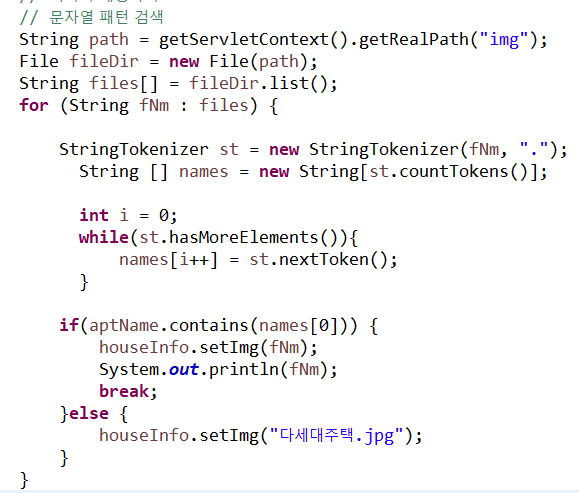
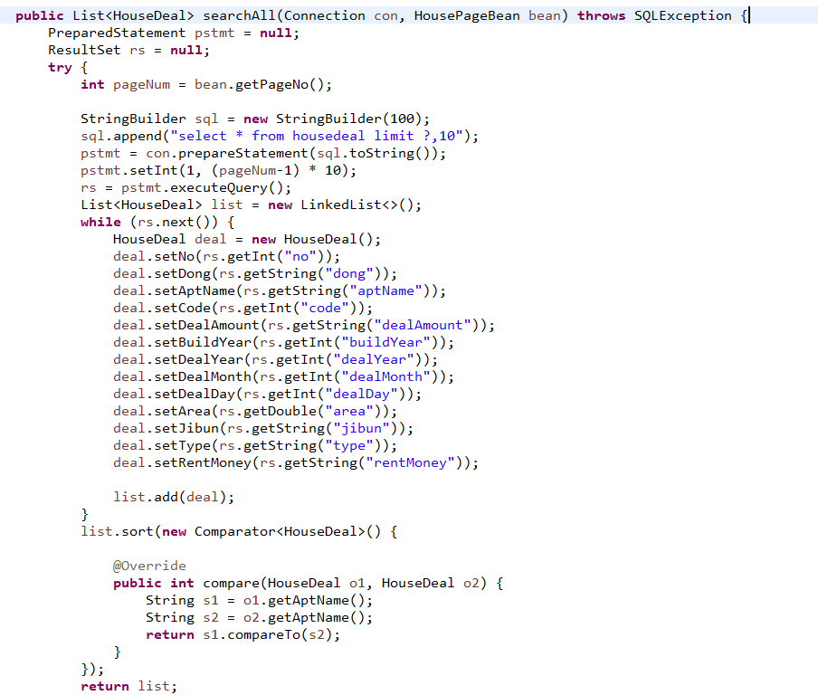
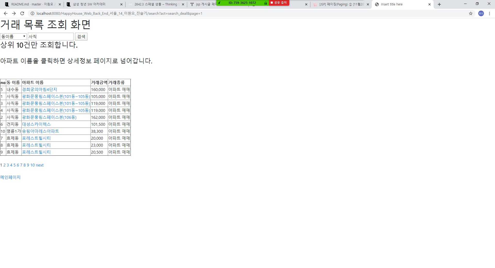
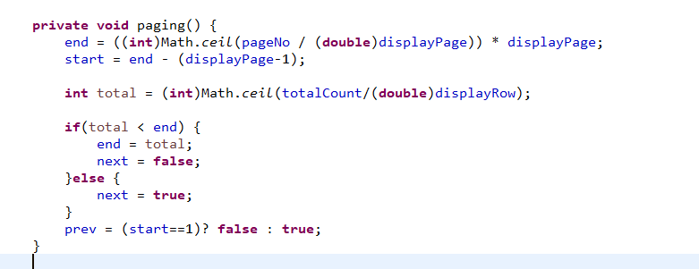

# 관통프로젝트: HappyHouse_Algo_서울_14반_이원오_진슬기
### 제출일: 2020.04.27

### 참여 페어
- 이원오, 진슬기

### 처리된 요구사항 목록
  
|난이도|구현기능|작성여부|캡쳐|
|:---:|:---:|---|:---:|
|기본|알고리즘 2개 이상 추가|O|O| 

### 실행화면 캡쳐    

#### - 알고리즘 1 

-  문자열 패턴 검색 알고리즘

#### - 알고리즘 2

-  아파트이름 정렬

#### - 알고리즘 3 

-  페이징 처리

 
 